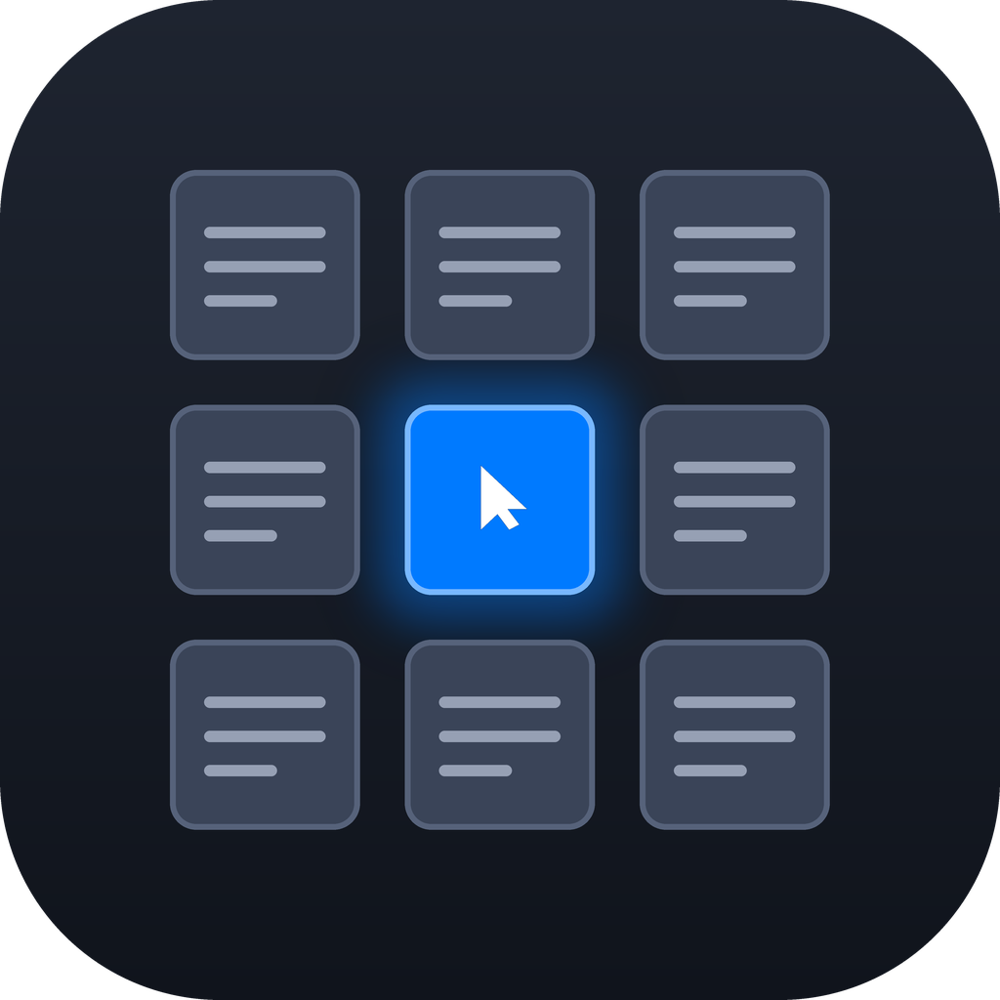
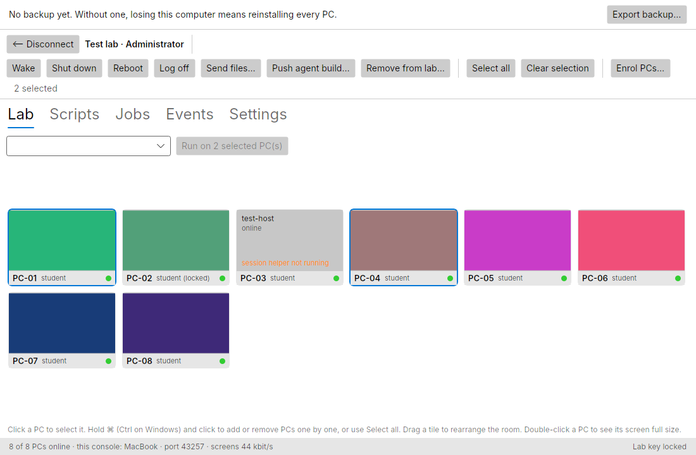
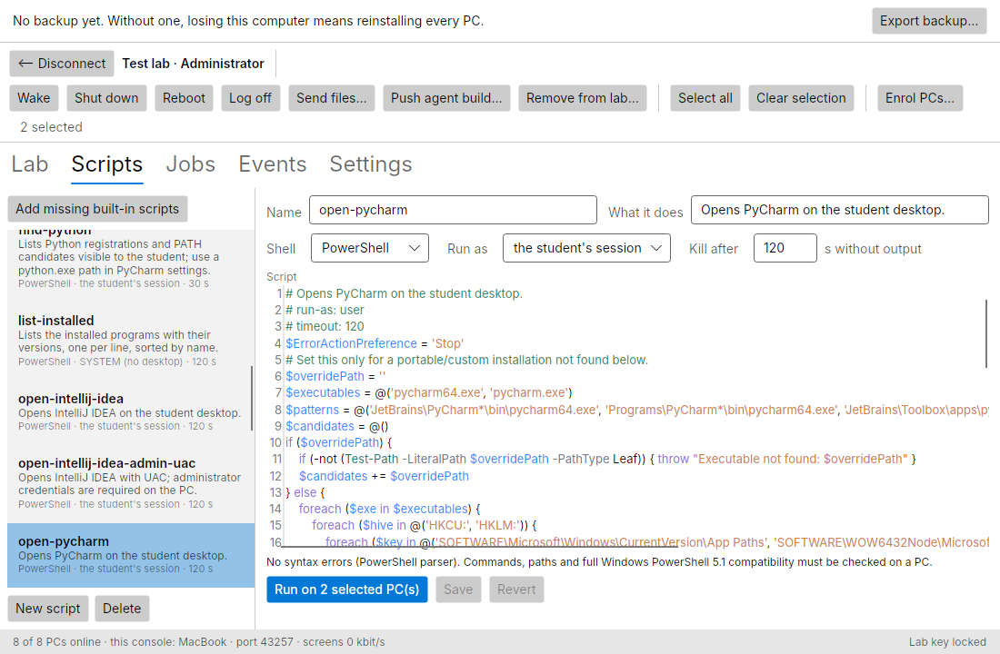
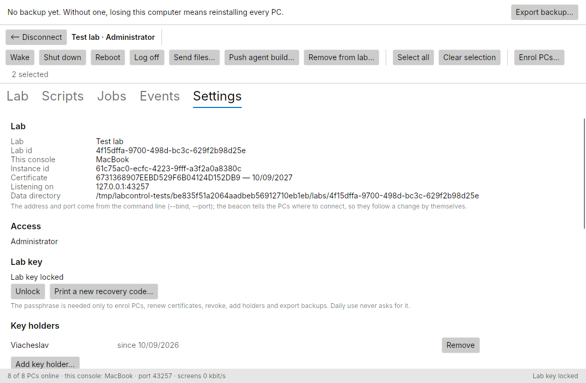
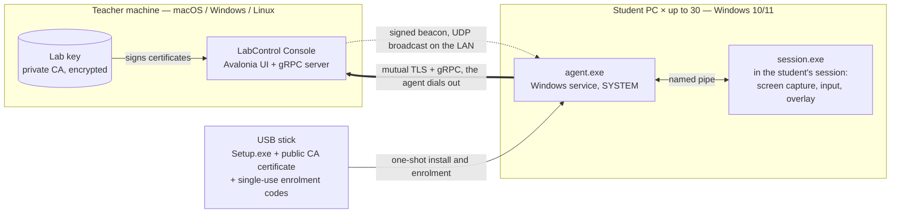

<div align="center">



# LabControl

**Керування комп'ютерним класом: екрани, керування живленням, скрипти й файли на весь клас.**<br>
**Classroom computer-lab control: live screens, power control, scripts and files for the whole room.**

[](https://dotnet.microsoft.com/)
[](docs/INSTALLER.md)
[](LICENSE)

</div>

LabControl — це самостійна система для керування комп'ютерним класом: одна консоль
викладача (macOS, Windows або Linux) бачить екрани всіх учнівських ПК з Windows, вмикає й
вимикає їх, запускає скрипти й роздає файли на весь клас одночасно. Їй не потрібні сервер,
хмара, домен чи інтернет — лише локальна мережа класу. Кожен ПК готується одним проходом
USB-інсталятора.

LabControl is a self-hosted classroom-management system for one computer lab at a time:
**one teacher console** on macOS, Windows or Linux manages **up to 30 Windows student
PCs** on the same LAN. It replaces walking from desk to desk to install software, power
machines on and off, and watch what students are doing.

<p align="center">
  
</p>

<table>
  <tr>
    <td width="50%"></td>
    <td width="50%"></td>
  </tr>
  <tr>
    <td align="center"><sub>Script library — run on every selected PC, per-PC results</sub></td>
    <td align="center"><sub>Settings — the lab's own certificate authority and its key holders</sub></td>
  </tr>
</table>

## Можливості / Features

- **Live screen mosaic and remote control** — every student screen at once; double-click a
  tile for a full-size view and take over the mouse and keyboard, *Ctrl+Alt+Del* included.
- **Power for one PC or the whole room** — Wake-on-LAN, shutdown, reboot and log off.
- **Scripts and files on all PCs in parallel** — a PowerShell / cmd script library and
  file handouts over the LAN, with a separate result and log for every PC; the installer
  catalog for silent software installs is planned for M7.
- **Broadcast, lock and exam mode** *(planned, M6)* — show the teacher's screen on every
  PC, lock screens with a message, and an exam mode built from four independent switches
  (timer, allowed programs, internet block, collect work) that always restores the PC by
  itself.
- **One-shot USB installer** — run once as administrator on each PC; it asks at most the
  PC number and does the rest: service, firewall, Wake-on-LAN, power settings, a standard
  `student` account with auto-logon, enrolment. A standalone uninstaller restores the PC.
- **No server, no cloud, no domain, no internet** — everything runs on the lab's own LAN.
- **A replaceable teacher console** — the lab's identity is its own certificate authority,
  so moving the console to another computer is one encrypted backup file and no student
  PC is touched. Several saved labs, one active room at a time.
- **Up to 30 PCs per lab** — nothing assumes the first room's 14.

## Як це працює / How it works



- The **console** holds the lab key — a private certificate authority — and runs the gRPC
  server. It announces itself with a beacon signed through that CA, so PCs find it on
  any IP address without configuration.
- The **agent** is a Windows service on every PC. It verifies the beacon, dials out and
  keeps one mutually authenticated TLS link: commands and events, plus separate streams
  for video and files. It never trusts an IP address or a hostname, only the lab's CA.
- **`session.exe`** is the agent's helper inside the interactive session: it captures the
  screen (DXGI, GDI fallback), injects the teacher's input and draws the overlays.
- The **USB stick carries no secret**: only the public CA certificate and single-use
  enrolment codes. Each PC generates its own key and gets its certificate at first contact.

Details: [Architecture](docs/ARCHITECTURE.md) · [Protocol](docs/PROTOCOL.md) ·
[Installer](docs/INSTALLER.md).

## Швидкий старт / Quick start

Requires the [.NET 10 SDK](https://dotnet.microsoft.com/download/dotnet/10.0); nothing
else. The Windows projects compile on macOS and Linux too.

```bash
dotnet build
dotnet test
dotnet run --project src/LabControl.Console            # first run: the wizard creates a lab
#   Settings → Write USB payload… → choose a folder, e.g. ~/usb
dotnet run --project src/LabControl.FakeAgent -- --count 14 --payload ~/usb
#   in the console: Enrol PCs… → passphrase → 14 simulated PCs enrol and appear
```

`FakeAgent` plays a whole room of PCs with synthetic screens, so the console can be tried
on any computer without a single Windows machine.

**Packages.** The teacher console installs per user from one file per platform, into
`artifacts/package/`:

| Script | Produces |
|---|---|
| [`tools/package-windows.sh`](tools/package-windows.sh) | one self-contained `Setup.exe` for Windows |
| [`tools/package-mac.sh`](tools/package-mac.sh) | `LabControl.app` in a DMG (needs macOS) |
| [`tools/package-linux.sh`](tools/package-linux.sh) | a tarball with `install.sh` / `uninstall.sh` |
| [`tools/package-all.sh`](tools/package-all.sh) | all three |

The student-PC side is built with [`tools/publish-all.sh`](tools/publish-all.sh) and
[`tools/build-usb.sh`](tools/build-usb.sh); see [the installer guide](docs/INSTALLER.md).
Command-line options, the simulator's failure injection, the Windows VM workflow and
more are in [docs/DEVELOPMENT.md](docs/DEVELOPMENT.md).

## Статус / Status

| Milestone | Scope | State |
|---|---|---|
| **M0** | Skeleton and toolchain | ✅ done (2026-09-04) |
| **M1** | Lab identity, link and presence | ✅ done (2026-09-05) |
| **M2** | Windows agent: service, helper, power, scripts | ✅ built and verified on a VM and a lab PC |
| **M3** | Screens: mosaic, full view, remote control | ✅ built and verified on a lab PC; close-out measurements remain |
| **M4** | Deployment: USB installer, files, self-update | 🔨 in progress — `1.0.0` release candidate in the first lab |
| **M5** | Lab files, teacher access, fast switching between rooms | 🔨 in progress — all portions built, field acceptance remains |
| **M6** | Classroom control: broadcast, lock, exam mode | 📋 planned |
| **M7** | Software catalog, localization (uk / en / ru), polish | 📋 planned |

The detailed acceptance criteria and verification ledger are in the
[roadmap](docs/ROADMAP.md).

## Документація / Documentation

| Document | What it answers |
|---|---|
| [`docs/ROADMAP.md`](docs/ROADMAP.md) | What gets built, in what order, and how each milestone is judged done |
| [`docs/ARCHITECTURE.md`](docs/ARCHITECTURE.md) | Components, processes, data flow, threat model |
| [`docs/PROTOCOL.md`](docs/PROTOCOL.md) | gRPC services, discovery, video encoding, job lifecycle |
| [`docs/INSTALLER.md`](docs/INSTALLER.md) | Student USB Setup and the teacher-console packages for Windows, macOS and Linux |
| [`docs/DEVELOPMENT.md`](docs/DEVELOPMENT.md) | Building and testing: command lines, the simulator, the Windows VM, status notes |
| [`docs/DECISIONS.md`](docs/DECISIONS.md) | Why each choice was made, and what was rejected |
| [`CLAUDE.md`](CLAUDE.md) and [`AGENTS.md`](AGENTS.md) | Shared project context and working rules for Claude Code and Codex |

The same documents are mirrored as a small self-contained website in
[`docs/html/`](docs/html/index.html) — open `docs/html/index.html` in any browser, no
internet required. **The Markdown files are the source of truth**; the HTML is
generated. After editing any `.md`:

```bash
tools/docs-build.sh
```

## Ліцензія / License

[MIT](LICENSE) © 2026 Viacheslav Stohul, Одеський технічний фаховий коледж ОНТУ.

---

<div align="center">

Розроблено в [Одеському технічному фаховому коледжі ОНТУ](https://otfk.od.ua/)

</div>
